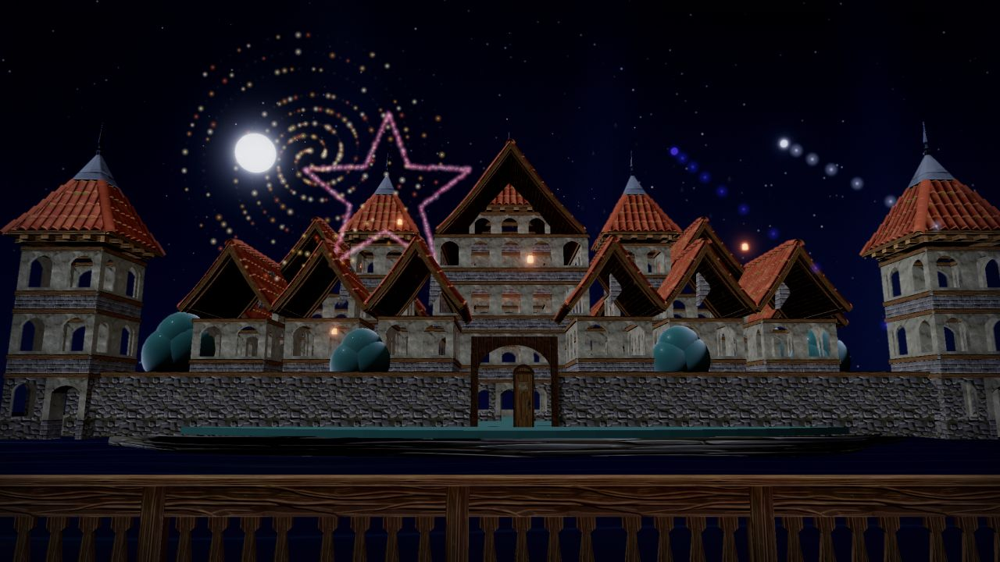
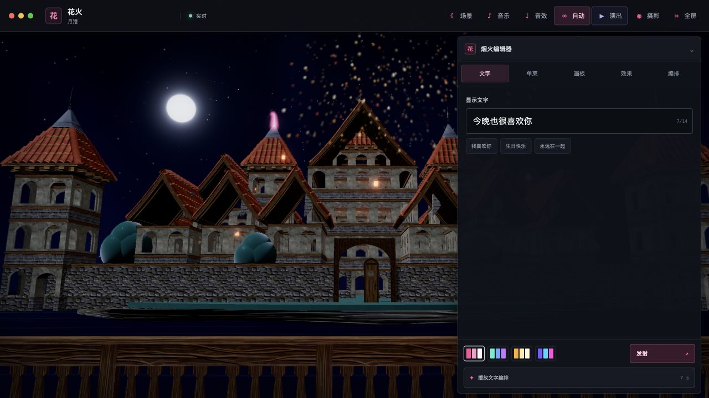
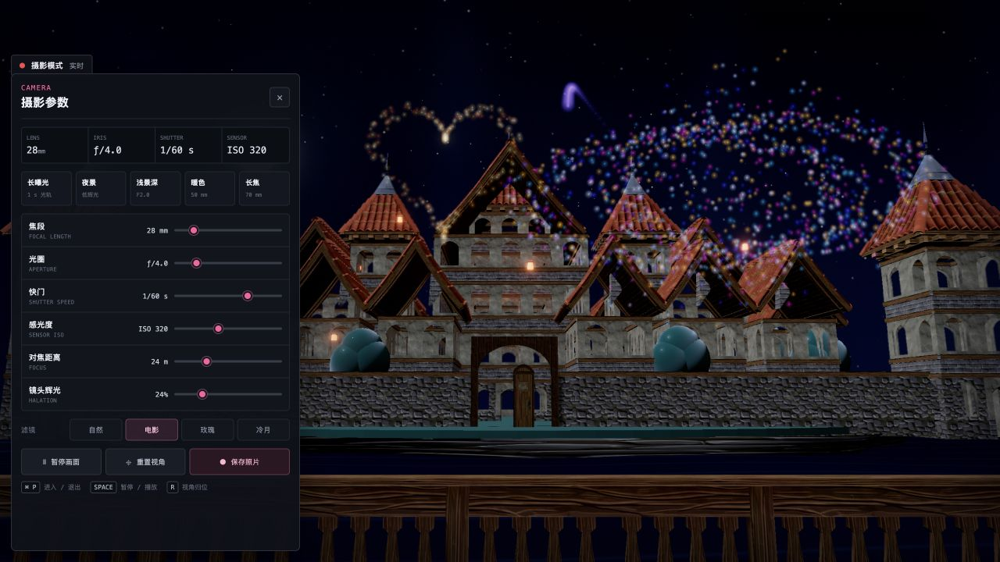
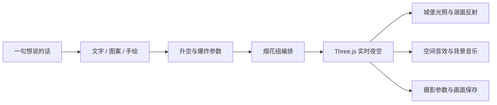

<div align="center">



<br />

# 花火 · HANABI

### 把没说完的话，写进今晚的夜空。

一场为两个人准备的实时 3D 烟花夜。坐在月港露台，从人的视线仰望城堡与星空；亲手写下文字、画出图案、编排整场花火，然后让它在音乐与湖光之间慢慢盛放。

<p>
  
  
  
  
</p>
<p>
  
  
  
  <a href="https://hanabi-sage-beta.vercel.app"></a>
  
</p>

**[立即进入花火](https://hanabi-sage-beta.vercel.app)** · **[运行项目](#在本地升起第一束花火)** · **[操作方式](#操作方式)** · **[素材与许可](#素材与许可)**

</div>

---

## 今夜，天空会记得

花火不是一个烟花播放器。

它更像一封可以走进去的信：镜头落在双人座位的眼睛高度，远处是被月光照亮的城堡，身边有夜风、音乐和真实的爆炸回声。你可以只静静看完一场 78 秒的六幕演出，也可以打开创作台，把一句话、一颗心或一段只属于你们的顺序交给夜空。

> 序幕、相遇、靠近、心跳、盛放、余韵。<br />
> 烟火会熄灭，但那个一起抬头的人不会被夜色忘记。

## 一座可以亲手点亮的月港

| | |
|:--|:--|
| **实时 3D 夜景** | PBR 城堡、湖面反射、月光、薄雾与烟花动态照明共同组成同一座世界。 |
| **十二种烟花图案** | 牡丹、菊型、爱心、土星环、垂柳、星星、螺旋、蝴蝶、棕榈、皇冠、双环与流星。 |
| **完整烟花设计器** | 自定义文字、960 × 560 手绘画板、颜色、爆炸强度、散开程度、拖尾、升空方式与消散形态。 |
| **烟花组编排** | 自由选择图案、配色和幕间间隔，排序后播放一整组只属于你的演出。 |
| **电影摄影模式** | 焦段、光圈、快门、ISO、对焦距离、镜头辉光与四款调色滤镜，支持暂停与 PNG 保存。 |
| **有呼吸的声音** | 多层真实烟花录音、升空与爆炸空间声场、内置肖邦夜曲，也支持上传自己的音乐。 |

## 创作台



文字、图案、画板、效果与编排被收进一张独立应用式工作台。它不会打断观赏，只在你想把夜空变成画布时出现。

## 把夜空当作取景器



按下 `⌘ P`，场景就变成一台可以真正调节的夜景相机。长曝光让光轨停留，长焦把烟花拉近，浅景深与电影滤镜则决定这一晚被怎样记住。

## 花火的组成



核心渲染、粒子、镜头和音频均在浏览器中实时运行。烟花的颜色会同时影响城堡灯光与湖面反射；文字和手绘图案通过 Canvas 采样成为粒子轮廓，而不是预先录制的视频。

## 操作方式

| 操作 | 效果 |
|:--|:--|
| 拖动夜空 | 像坐在露台上一样，上下左右转动视线 |
| 点击夜空 | 在当前目光所指的位置升起一束花火 |
| `演出` | 播放 78 秒、六个章节的电影式烟花秀 |
| `自动` | 让不同图案、升空方式与消散效果持续交替 |
| 右侧 `花` | 打开文字、图案、画板、效果与烟花组创作台 |
| `场景` | 在月港、蔷薇露台、观星台三套实时氛围间切换 |
| `音乐` | 播放内置夜曲、调整音量或选择本地音乐 |
| `⌘ P` / `Ctrl P` | 进入或退出专业摄影模式 |
| `Space` | 在摄影模式中暂停或继续画面 |
| `R` | 将视线回到双人座位的初始方向 |

## 在本地升起第一束花火

需要 Node.js `22.13+`。

```bash
git clone https://github.com/MarcWebber/hanabi.git
cd hanabi
npm install
npm run dev
```

打开终端给出的地址，戴上耳机，然后把浏览器交给今晚。

生产构建：

```bash
npm run build
npm run start
```

## 技术栈

- **Three.js / WebGL 2** — 场景、PBR 材质、粒子烟花、镜头与后期处理
- **React 19 / TypeScript** — 创作台、摄影控制台与应用状态
- **Unreal Bloom** — 克制的高光与烟花辉光
- **Web Audio API** — 真实录音分层、空间定位与合成升空声
- **Blender + Draco** — 英雄场景构建、角色蒙皮与压缩交付
- **vinext / Vite** — 页面外壳与构建链路

```text
app/                         页面入口与全局视觉
src/fireworks/               烟花体验、场景与类型定义
src/fireworks/audio/         空间音效与真实录音调度
src/fireworks/world/         月港世界、光照与角色
public/models/               Draco 场景模型与第三方许可
public/audio/                烟花录音与音乐
public/readme/               README 实机画面
scripts/build_hero_assets.py Blender 英雄场景构建脚本
```

## 素材与许可

花火本体仍处于个人作品阶段，尚未声明统一的开源许可证。城堡、人物、音乐、烟花录音与 Draco 解码器分别遵循其原始许可；完整来源和归属记录见：

- [`public/models/THIRD_PARTY_ASSETS.md`](./public/models/THIRD_PARTY_ASSETS.md)
- [`public/models/licenses/`](./public/models/licenses/)
- [`public/audio/fireworks/README.md`](./public/audio/fireworks/README.md)
- [`public/draco/LICENSE`](./public/draco/LICENSE)

如需二次发布，请先逐项确认这些资产的许可要求。

---

<div align="center">

### 愿你想说的话，都有人陪你等到它在夜空里盛开。

<sub>花火 · Hanabi — made for one night, remembered for much longer.</sub>

</div>
